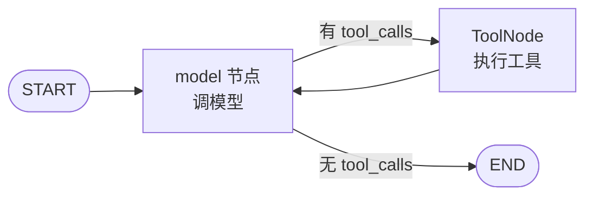
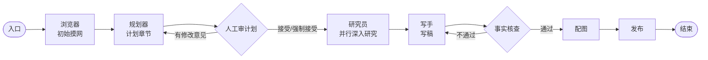

# 从代码理解 Agent 是如何工作的

> 结合工作区内的两个真实仓库 `gpt-researcher/`（29k★，开源深度研究 Agent）与 `langchain/`（144k★，LLM 应用框架）的源码，一步步拆解 Agent 的实现原理。
> 整理日期：2026-08-17

---

## 目录

1. [总览：一个 Agent 的完整工作循环](#一总览一个-agent-的完整工作循环)
2. [Agent 的底层原语：思想 → 协议 → 框架实现](#二agent-的底层原语思想--协议--框架实现)
3. [gpt-researcher 解析：单 Agent 与多智能体编排](#三gpt-researcher-解析单-agent-与多智能体编排)

---

## 一、总览：一个 Agent 的完整工作循环

无论框架怎么封装，一个 Agent 的本质都是下面这个循环（对应知识手册 4.2 的"目标-计划-行动-观察-判断"闭环）：

```
┌────────────────────────────────────────────────────────┐
│  循环开始：拿到一个任务（用户 Query）                        │
│                                                          │
│  ① 思考/规划：让大模型决定"下一步做什么"（拆解、选工具、定参数）  │
│         ↓                                                │
│  ② 行动：调用工具（搜索、抓取、执行命令、查库……）             │
│         ↓                                                │
│  ③ 观察：把工具的返回结果作为 Observation 塞回上下文          │
│         ↓                                                │
│  ④ 判断：模型看 Observation 决定——继续循环 or 输出最终答案     │
│         ↑______________________ 可以转 N 圈 ________________│
└────────────────────────────────────────────────────────┘
```

**两种工程实现形态**（这是理解两个仓库的关键视角）：

| 形态 | 实现方式 | 代表 |
|---|---|---|
| **命令式循环** | `while` 循环：调模型→解析动作→调工具→塞回历史→直到停止条件 | langchain 经典版 `AgentExecutor` |
| **图式编排** | 把每个环节当作图的"节点"，用"边/条件边"表达流程与循环 | LangGraph 的 `StateGraph`、gpt-researcher 的 `multi_agents` |

gpt-researcher ：
**单 Agent 版**既不是严格 ReAct 循环，也不是图，而是"**规划-执行-汇总（Planner → Executor → Publisher）**"三段式流水线；
**多智能体版**则完整用了 LangGraph 图编排。下面先讲通用的底层原语（第二部分），再拆解真实项目 gpt-researcher（第三部分）。

---


## 二、Agent 的底层原语：思想 → 协议 → 框架实现

### 2.0 总览：涉及概念理清

先给本节骨架：**ReAct、Function Calling、LangChain / LangGraph 不是包含关系**，它们处在三个不同的抽象层。

| 概念 | 本质 | 层面 | 归属 |
|---|---|---|---|
| **ReAct** | Agent 设计模式（论文思想） | 思想 / 方法论 | **不属于任何框架**， |
| **Function Calling** | 模型↔程序 的调用协议 | 接口 / 标准 | **模型 API 的能力**（如 OpenAI），返回结构化文本 |
| **LangChain / LangGraph** | 开发框架（代码库） | 工程 / 实现 | 把 ReAct、FC 实现成积木的**两个平行框架** |

```
┌─────────────────────────────────────────────┐
│ 思想层   ReAct（如何决策 & 是否循环）          │ ← 设计模式 ---|
├─────────────────────────────────────────────┤               |---正交关系
│ 协议层   Function Calling（模型怎么表达调用）  │ ← 接口标准 ---|
├─────────────────────────────────────────────┤
│ 实现层   LangChain / LangGraph              │ ← 代码实现（两个平行框架）
│          ├ create_react_agent  → 实现 ReAct │
│          ├ create_tool_calling_agent → 接入 FC│
│          └ ToolNode / bind_tools（工具执行） │
├─────────────────────────────────────────────┤
│ 应用层   具体 Agent 框架（如 gpt-researcher） │ ← 你的应用
└─────────────────────────────────────────────┘
```


本节目录：

- `2.1` 思想层 · ReAct —— 什么是 ReAct
- `2.2` 协议层 · Function Calling —— 什么是 FC
- `2.3` 实现层 · LangChain 框架本体 —— Runnable / LCEL / 工具抽象
- `2.4` 实现层 · LangChain 如何落地"思想 + 协议" —— create_react_agent / create_tool_calling_agent
- `2.5` 实现层 · LangGraph —— 用"图"承载循环（与 LangChain 平行，不是父子）


### 2.1 思想层 · ReAct（决策范式）

ReAct 是论文提出的一种 **Agent 设计模式**（Yao et al., 2022），核心是让"推理（Reasoning）"与"行动（Acting）"交织循环：

```
Thought（思考：下一步做什么） → Action（行动：调用工具） → Observation（观察：工具结果） → 再 Thought ...
```

- **设计思想**：任何框架都能实现它，LangChain 只是"实现"了它的一种版本（见 2.4.1）
- **与 CoT 的关系**：ReAct 的"思考"环节本质就是一次局部 CoT（思维链）；ReAct 在 CoT"只思考"的基础上增加了"行动 + 观察"，从"闭卷答题"升级为"开卷做题"
- **循环出口**：当模型认为信息已足够，就输出最终答案，停止循环


### 2.2 协议层 · Function Calling（模型与程序之间的**接口协议**）

Function Calling（函数调用）是**模型 API 提供的一种能力**：模型收到工具的 JSON Schema 后，**原生返回结构化的调用请求**：

```json
{"name": "search", "args": {"q": "xxx"}, "id": "call_1"}
```

- **单步协议 vs 完整流程**：协议只负责"模型说出要调什么"这一步，**不包含循环**；循环由外部（AgentExecutor / LangGraph 图）驱动

**具体实现（原生做法）：三步**

**① 构造"工具 schema"**——描述工具的完整结构（`name` + `description` + `parameters`）：

```json
{
  "type": "function",
  "function": {
    "name": "get_weather",
    "description": "查询指定城市的天气",
    "parameters": {                                    // 参数部分的 JSON Schema
      "type": "object",
      "properties": {"city": {"type": "string"}},
      "required": ["city"]
    }
  }
}
```

> 工具 schema = 给模型看的"工具使用说明书"；`parameters` 只是其中"参数怎么填"那一段（JSON Schema），模型据此知道参数类型与必填项。

**② 调用 API 时把 `tools` 作为请求参数传给模型**：

```python
resp = client.chat.completions.create(
    model="gpt-4o",
    messages=[{"role": "user", "content": "北京的天气？"}],
    tools=[tool_schema],          # ← 原生机制：走 API 的 tools 参数
)
```

**③ 模型"原生"返回结构化 `tool_calls`**（格式由 API 层保证，无需再解析）：

```python
msg = resp.choices[0].message
msg.tool_calls
# [ToolCall(id='call_1',
#          function=Function(name='get_weather',
#                           arguments='{"city":"北京"}'))]
```

要点：
- 模型不是在"读 prompt 猜格式"，而是**请求带了 `tools` 参数 + 模型被专门训练过 tool-use 协议**，输出走独立的 `tool_calls` 字段，由 API 层保证结构；
- 若模型认为不需要工具，则不返回 `tool_calls`，只返回普通文本；
- 这就是 langchain `bind_tools()` 的底层机制：`@tool` 的函数 → 自动推断 `args_schema` → `convert_to_openai_tool` 转成上面的 schema 作为 `tools` 参数传出（见 2.4.2）。


### 2.3 应用层 · LangChain 框架
#### 2.3.1 框架本体：可组合的 Runnable 封装

LangChain 是**一个开发框架**，它把 LLM 应用的所有环节标准化为可组合的部分。它的原生逻辑一句话：**所有东西都是 Runnable，用 `|` 管道串成链**。

**① Runnable 协议（统一接口）**

```python
chain.invoke(input)      # 一次性跑完
chain.stream(input)      # 流式输出
chain.batch(inputs)      # 批量处理
chain.ainvoke(input)     # 异步版本
```
**①' Runnable 封装原理 **

在 `libs/core/langchain_core/runnables/` 下，Runnable 的封装由三层实现：

- **第 1 层：协议基类**——`base.py` 里的 `class Runnable(ABC, Generic[Input, Output])` 定义统一接口（`invoke/stream/batch/ainvoke`）并重载 `|`；模型、Prompt、解析器、工具、Agent 全都实现它，所以能互相拼接。
- **第 2 层：函数封装**——`RunnableLambda` 把普通 Python 函数变成 Runnable（docstring："converts a python callable into a Runnable"）：

```python
from langchain_core.runnables import RunnableLambda
def add_one(x): return x + 1
runnable = RunnableLambda(add_one)   # 函数 → Runnable
runnable.invoke(1)                   # → 2
```

需要流式就用 `RunnableGenerator`；同步/异步可各给一个实现 `RunnableLambda(func, afunc=async_func)`。

- **第 3 层：组合封装**——`A | B` 由 `Runnable.__or__` 实现，返回 `RunnableSequence(A, coerce_to_runnable(B))`：

```python
def __or__(self, other):                       # base.py
    return RunnableSequence(self, coerce_to_runnable(other))
```

`RunnableSequence` 依次调用每个元素，前一个输出自动成为后一个输入；**`coerce_to_runnable(other)` 会把普通函数自动包成 `RunnableLambda`**，所以 `prompt | model | add_one` 里写普通函数也能直接拼：

```python
chain = prompt | model | add_one   # add_one 是普通函数
# 实际 = RunnableSequence([prompt, model, RunnableLambda(add_one)])
```

此外 `runnables/` 里还有一堆预制封装：`RunnablePassthrough`（透传）、`RunnableParallel`（并行）、`RunnableBranch`（分支）、`RunnableRetry`（重试）、`RunnableWithFallbacks`（降级）等。

> 一句话：**Runnable 的封装 = 协议基类（统一接口）+ `RunnableLambda`（函数包装）+ `|` 生成 `RunnableSequence`（组合，且自动把函数转成 Runnable）**——你写的函数只是其中一环，最后都归一成同一个 Runnable 协议。


**② LCEL：用 `|` 组合组件**

```python
chain = prompt | model | output_parser   # Prompt → 模型 → 解析器
result = chain.invoke({"question": "..."})
```


**③ 组件模型：LangChain 把 LLM 应用拆成 5 类原语**

| 组件 | 作用 | 对应代码位置 |
|---|---|---|
| `Models` | 统一封装各家大模型 | `langchain_core.language_models`、`langchain-openai` 等 |
| `Prompts` | 模板、few-shot 示例管理 | `langchain_core.prompts` |
| `Tools` | 把函数包装成"模型可调用"的工具 | `langchain_core.tools`（`@tool`/`BaseTool`） |
| `Output Parsers` | 把模型输出解析成结构化数据 | `langchain_core.output_parsers`（`PydanticOutputParser` 等） |
| `Memory / 状态` | 维护历史与状态 | `state["messages"]` + `add_messages`（v1）、`checkpointer` |

**④ 工具抽象：`@tool` / `BaseTool`（基础积木）**

`libs/core/langchain_core/tools/` 定义了工具统一抽象，Agent 能做什么取决于你给它什么工具：

```python
# libs/core/langchain_core/tools/base.py  (BaseTool 关键字段)
name: str                 # 工具唯一名 —— 模型靠这个名字"点名"
description: str          # 告诉模型"什么时候/为什么要用我"
args_schema: ArgsSchema   # Pydantic 模型，定义参数 + 校验
return_direct: bool       # True 时执行完直接结束循环（不等模型）
```

最常用的是 `@tool` 装饰器（`tools/convert.py`）：**写一个带类型注解和 docstring 的函数，就自动变成一个工具**（自动推断参数 schema）。

**⑤ 工具调用机制：按 name 建表 + 查表**（贯穿 ReAct 与 FC 两种实现）

```python
name_to_tool_map = {tool.name: tool for tool in self.tools}   # 构建时按 name 建表
# 运行时用模型点名的工具名查表，args 过 Pydantic 校验后执行；查不到返回 InvalidTool 错误观察
```

**⑥ Agent 本身也是 Runnable**

在 LangChain 里，Agent 不是特殊存在，也是一个 Runnable：输入 query，输出最终答案，内部是循环。区别只在于循环由谁驱动：经典版用 `AgentExecutor`（命令式循环），v1 用 LangGraph 图（图式循环）。

**⑦ 原生逻辑总结**

- **提供**：模型接口、工具封装、向量库、解析器、循环驱动器——都是 Runnable 积木；
- **不决定**：业务是"流水线"还是"图"、一步还是循环；如，gpt-researcher 选了自研流水线 + LangChain 当工具箱，multi_agents 选了 LangGraph 当骨架）。

#### 2.3.2 具体实现：思想 + 协议

> 说明：`langchain/` 在本工作区是 monorepo 布局（真实结构）：

| 路径 | 包 | 版本 |
|---|---|---|
| `libs/core/langchain_core/` | `langchain_core` | 核心抽象：`BaseTool`、`AgentAction`、`AgentFinish` 等 |
| `libs/langchain/langchain_classic/` | `langchain_classic` | 经典版：`create_react_agent`、`AgentExecutor` |
| `libs/langchain_v1/langchain/` | `langchain`（v1） | 新版：`create_agent`（基于 LangGraph） |
| `langgraph` | `langgraph` | 不在 libs/ 下，是外部依赖（`langgraph>=1.2.11`） |


ReAct 是思想、FC 是协议，而 langchain 把它们**实现成可调用的代码**（都放在 `langchain_classic/agents/` 下）：

#### 2.3.2.1 对 ReAct 的实现：`create_react_agent` + `AgentExecutor`（文本格式 + 正则解析）

**ReAct 提示词模板**（`libs/langchain/langchain_classic/agents/mrkl/prompt.py`）——模型的"操作手册"：

```
Use the following format:
Question: the input question you must answer
Thought: you should always think about what to do
Action: the action to take, should be one of [{tool_names}]
Action Input: the input to the action
Observation: the result of the action
... (this Thought/Action/Action Input/Observation can repeat N times)
Thought: I now know the final answer
Final Answer: the final answer to the original input question
```

**Agent 是一条链**（`create_react_agent`）——历史格式化成 scratchpad → 拼提示词 → 调模型（带 stop）→ 解析输出：

```python
return (
    RunnablePassthrough.assign(
        agent_scratchpad=lambda x: format_log_to_str(x["intermediate_steps"]),  # 历史→字符串
    )
    | prompt
    | llm_with_stop                       # llm.bind(stop=["\nObservation"]) 防止幻觉
    | output_parser                       # ReActSingleInputOutputParser
)
```

**输出解析器**（`ReActSingleInputOutputParser`）——用正则从模型文本里抠出"动作"：

```python
regex = r"Action\s*\d*\s*:[\s]*(.*?)Action\s*\d*\s*Input\s*\d*\s*:[\s]*(.*)"
action_match = re.search(regex, text, re.DOTALL)
if action_match:
    return AgentAction(action, tool_input, text)     # → 要去调用某个工具
if includes_answer:
    return AgentFinish({"output": ...}, text)        # → 结束，给出最终答案
```

**AgentExecutor 主循环**（`libs/langchain/langchain_classic/agents/agent.py` 的 `_call`）——"命令式 ReAct 循环"的实现：

```python
name_to_tool_map = {tool.name: tool for tool in self.tools}
intermediate_steps: list[tuple[AgentAction, str]] = []   # 历史 = (动作, 观察) 列表
iterations = 0
while self._should_continue(iterations, time_elapsed):   # max_iterations=15 / 超时
    next_step_output = self._take_next_step(name_to_tool_map, ..., intermediate_steps, ...)
    if isinstance(next_step_output, AgentFinish):        # 模型说 Final Answer → 结束
        return self._return(next_step_output, ...)
    intermediate_steps.extend(next_step_output)          # 把 (action, observation) 追加进历史
    iterations += 1
```

单步 `_perform_agent_action`——按模型点名的工具名查表并执行：

```python
if agent_action.tool in name_to_tool_map:
    tool = name_to_tool_map[agent_action.tool]
    observation = tool.run(agent_action.tool_input, ...)   # 真正调用工具
else:
    observation = InvalidTool().run({...})                 # 模型点错工具 → 回一个错误观察
return AgentStep(action=agent_action, observation=observation)
```

> 这就是 langchain 对 ReAct 的实现：模型产出 `Thought/Action/Action Input` → 解析成 `AgentAction` → 执行工具得到 `Observation` → 塞回历史 → 循环，直到 `Final Answer` 或超过 `max_iterations`。

#### 2.3.2.2 对 Function Calling 协议的接入：`create_tool_calling_agent` + `bind_tools`

利用模型原生的结构化 `tool_calls`（不再靠正则从文本里抠 Action）：

```python
llm_with_tools = llm.bind_tools(tools)     # 把工具 schema 传给模型 API
return (
    RunnablePassthrough.assign(agent_scratchpad=lambda x: message_formatter(x["intermediate_steps"]))
    | prompt
    | llm_with_tools
    | ToolsAgentOutputParser()
)
```

解析 `tool_calls`（`parse_ai_message_to_tool_action`）：

```python
for tool_call in message.tool_calls:
    actions.append(ToolAgentAction(
        tool=tool_call["name"], tool_input=tool_call["args"],
        log=log, message_log=[message], tool_call_id=tool_call["id"]))
```

把观察还原成消息（`format_to_tool_messages`）——通过 `tool_call_id` 把工具结果和模型发起的调用一一对应：

```python
_create_tool_message(agent_action, observation)
# → ToolMessage(tool_call_id=agent_action.tool_call_id, content=...)
```

> 两种实现的取舍：
> - ReAct（文本）：兼容任意模型（只要会按格式输出文本），但靠正则解析、易出错；
> - Tool calling（FC）：模型原生支持结构化调用，准确、省 Token，但要求模型实现 `bind_tools()`（OpenAI 及多数现代模型都支持）。

### 2.4 应用层 · LangGraph：用"图"承载循环（与 LangChain 平行，不是父子）

LangGraph 不在本仓库（外部依赖 `langgraph>=1.2.11`）。它和 LangChain **不是包含关系**：核心图引擎可以脱离 LangChain 独立使用（`StateGraph`/节点/边/状态不 import langchain），只是生态上互相配合——LangChain 的 v1 `create_agent` 用 LangGraph 做引擎，LangGraph 的 `ToolNode` 又用 LangChain 的 Tool/Message 类型。核心原语：

**`StateGraph`**：节点签名 `State -> Partial<State>`，需 `.compile()` 后 `invoke/stream`。

**`ToolNode`**（`langgraph.prebuilt.tool_node`）：专门执行工具的节点。它从状态里取出**最后一条 `AIMessage` 的 `tool_calls`**，并行调用对应工具，把结果包装成 `ToolMessage` 写回消息列表：

```python
# 从消息历史里找最后一条 AI 消息的 tool_calls
latest_ai_message = next(m for m in reversed(messages) if isinstance(m, AIMessage))
tool_calls = list(latest_ai_message.tool_calls)
# 对每个 tool_call 并行执行工具
outputs = list(executor.map(self._run_one, ...))   # 线程池并行
```

**路由函数**（停止条件）——决定"去工具节点"还是"结束"：

```python
if len(last_ai_message.tool_calls) == 0:   # 模型没发起工具调用 → 结束
    return end_destination
pending = [c for c in last_ai_message.tool_calls if c["id"] not in tool_message_ids]
if pending:
    return [Send("tools", [tool_call]) for tool_call in pending]  # → 去执行工具
```

**`add_messages`（reducer）**：消息历史 `state["messages"]` 是"追加式"列表，同 `id` 覆盖、`RemoveMessage` 删除——"模型每轮返回 `AIMessage`、工具返回 `ToolMessage`，历史不断累积"的机制。

整张图的数据流（经典 Agent 循环的图表达）：



> 业务用图表达：节点 = 环节，边 = 流程，循环靠"绕回来的边"（这是线性链做不到的）。gpt-researcher 的 `multi_agents` 就用 `StateGraph` 把 7 个角色编排成图（见 3.2）。


## 三、gpt-researcher 解析：单 Agent 与多智能体编排

下面用同一个真实项目 `gpt-researcher` 的两种形态，看"底层原语"如何落到具体业务：**单 Agent 版**是自己写的"规划-执行-汇总"流水线（不依赖 LangChain 的 Agent 抽象，只把它当工具箱）；**多智能体版**用 LangGraph 图编排。

### 3.1 单 Agent：真实项目怎么跑通"研究"任务

#### 3.1.1 组件划分：一个 Agent 被拆成了哪些"部件"

`gpt_researcher/agent.py` 里的 `GPTResearcher` 类，在 `__init__` 里组装了这些组件（真实代码，节选）：

```python
# gpt_researcher/agent.py  (GPTResearcher.__init__ 尾部)
self.retrievers = get_retrievers(self.headers, self.cfg)          # 检索器列表（Tavily/Bing/...）
self.memory = Memory(self.cfg.embedding_provider, self.cfg.embedding_model, ...)  # 向量记忆

# 把整个流程拆成几个"技能"组件，各自负责一段
self.research_conductor: ResearchConductor = ResearchConductor(self)   # 研究执行（核心）
self.report_generator: ReportGenerator = ReportGenerator(self)          # 报告生成
self.context_manager: ContextManager = ContextManager(self)             # 上下文（向量检索压缩）
self.scraper_manager: BrowserManager = BrowserManager(self)             # 网页抓取
self.source_curator: SourceCurator = SourceCurator(self)                # 来源筛选
```

设计要点：**一个 Agent = 一个大脑（LLM）+ 一双手（工具/检索器/抓取器）+ 一个记忆（向量库）**，通过"组件"（skills）把职责拆开，主类只做编排。

#### 3.1.2 主流程：`conduct_research()`

核心代码在 `gpt_researcher/skills/researcher.py`。主流程分三大步（真实代码结构）：

```python
# gpt_researcher/skills/researcher.py  (ResearchConductor.conduct_research)
async def conduct_research(self):
    # ① 如果没指定角色，先让 LLM 根据 query 选择"研究专家角色"
    if not (self.researcher.agent and self.researcher.role):
        self.researcher.agent, self.researcher.role = await choose_agent(query=..., cfg=..., ...)

    # ② 根据数据来源走不同分支（网页 / 本地文档 / 混合 / 指定 URL ...）
    if self.researcher.report_source == ReportSource.Web.value:
        research_data = await self._get_context_by_web_search(self.researcher.query, [], ...)
    elif self.researcher.report_source == ReportSource.Hybrid.value:
        docs_context, web_context = await asyncio.gather(
            self._get_context_by_web_search(self.researcher.query, document_data, ...),
            self._get_context_by_web_search(self.researcher.query, [], ...),
        )
        research_data = self.researcher.prompt_family.join_local_web_documents(docs_context, web_context)
    # ...

    # ③ 把收集到的内容存进 context（后续写报告用）
    self.researcher.context = research_data
    return self.researcher.context
```

其中 `_get_context_by_web_search` 内部把"规划"和"执行"分开（真实代码节选）：

```python
# 先规划出多个子查询
sub_queries = await self.plan_research(query, query_domains)
if self.researcher.report_type != "subtopic_report":
    sub_queries.append(query)              # 把原始问题也加入，防止漏掉

# 用 asyncio.gather 并行处理每个子查询（检索 + 抓取 + 压缩）
context = await asyncio.gather(
    *[self._process_sub_query(sub_query, scraped_data, query_domains) for sub_query in sub_queries]
)
```

**关键点**：这是一个**并行流水线**——一个主问题被拆成 N 个子查询，N 个子查询**同时**执行，最后合并上下文。这与"严格 ReAct 串行循环"不同。

#### 3.1.3 Planner（规划器）：把问题拆成子查询

规划逻辑在 `gpt_researcher/actions/query_processing.py`：

```python
# gpt_researcher/actions/query_processing.py  (generate_sub_queries)
async def generate_sub_queries(query, parent_query, report_type, context, cfg, ...):
    gen_queries_prompt = prompt_family.generate_search_queries_prompt(
        query, parent_query, report_type, max_iterations=cfg.max_iterations or 3, context=context)
    response = await create_chat_completion(
        model=cfg.strategic_llm_model,                     # 用"策略模型"（更强的模型）来规划
        messages=[{"role": "user", "content": gen_queries_prompt}], ...)
    return _normalize_sub_queries(json_repair.loads(response), query)   # 解析 LLM 返回的 JSON
```

它用的提示词（`prompts.py` 的 `generate_search_queries_prompt`，真实片段）直接要求模型输出**一个 JSON 数组**：

```
Write 3 search queries to research the following task: "xxx"

Each query must be a plain natural language phrase. ...
You must respond with a list of strings in the following format: ["query 1", "query 2", "query 3"].
The response should contain ONLY the list.
```

> 这里体现的通用技巧：**让模型输出结构化数据（JSON）**，再用 `json_repair.loads` 健壮地解析（模型输出不干净时自动修复），`_normalize_sub_queries` 再兜底（返回 dict/list/str/None 都归一成 `list[str]`）。

#### 3.1.4 Executor（执行器）：对每个子查询"检索→抓取→压缩"

`_process_sub_query` 是单子查询的执行单元（`skills/researcher.py`，真实代码节选）：

```python
async def _process_sub_query(self, sub_query, scraped_data=[], query_domains=[]):
    # ① 抓取：根据子查询找到 URL 并抓取正文
    if not scraped_data:
        scraped_data = await self._scrape_data_by_urls(sub_query, query_domains)

    # ② 压缩：用向量检索只挑出与子查询"最相关"的片段（避免上下文塞爆）
    if scraped_data:
        web_context = await self.researcher.context_manager.get_similar_content_by_query(
            sub_query, scraped_data)

    # ③ 合并 MCP 上下文与网页上下文
    combined_context = self._combine_mcp_and_web_context(mcp_context, web_context, sub_query)
    return combined_context
```

这里的"压缩"用到了向量库（`context_manager.get_similar_content_by_query`）：把所有抓到的网页切块、embedding、按子查询做相似度检索，只保留 top-k 相关片段——这正是知识手册 4.6 RAG 的实战应用。

#### 3.1.5 Publisher（发布器）：用收集的上下文写报告

`gpt_researcher/skills/writer.py` 的 `ReportGenerator.write_report` 把 `researcher.context` 交给 `generate_report()`。它的提示词（`prompts.py` 的 `generate_report_prompt`，真实片段）要求：

```
Information: "{context}"
---
Using the above information, answer the following query or task: "{question}" in a detailed report --
...
You MUST write the report with markdown syntax ...
Every substantive claim, figure or quote MUST carry an in-text citation to the source it came from.
Do NOT cite sources that do not appear in the provided information.
```

> 注意两个工程细节：
> 1. **禁止幻觉来源**：提示词明确"不要引用未出现在材料里的来源"；
> 2. **空上下文时拒绝生成**：`write_report` 里有个守卫（真实代码）——如果没收集到任何上下文，直接返回"无法生成有依据的报告"，而不是硬编一个看起来有依据的答案：
> ```python
> if not _ctx.strip():
>     return (f'I could not gather any source material for "{self.researcher.query}". ...')
> ```

#### 3.1.6 小结：这个单 Agent 是"流水线"而非"ReAct"

gpt-researcher 单 Agent 的执行形态：

```
用户问题
   → [Planner]  大模型拆出 3~N 个子查询（并行）
   → [Executor] 每个子查询：搜索 → 抓取 → 向量检索压缩 → 合并上下文
   → [Publisher] 大模型基于合并上下文写报告（带引用）
```

它**没有**"思考→行动→观察"的逐轮决策循环（那更像 ReAct / LangGraph），而是一次性的"规划-执行-汇总"流水线。这一点对理解很重要：**Agent 不只有 ReAct 一种形态，流水线（Pipeline）、工作流（Workflow）、图编排（Graph）都是常见的 Agent 工程形态。**

### 3.2 多智能体编排：gpt-researcher 的 LangGraph 版

`gpt-researcher/multi_agents/` 是同一个项目的"多智能体"版本，**完整使用了 LangGraph 的 `StateGraph`**。这是理解"框架如何落地"的最佳范例。

#### 3.2.1 智能体团队：7 个角色

`multi_agents/agents/orchestrator.py` 的 `_initialize_agents`（真实代码）：

```python
def _initialize_agents(self):
    return {
        "writer":       WriterAgent(...),        # 写作
        "editor":       EditorAgent(...),        # 规划章节 + 并行研究
        "research":     ResearchAgent(...),      # 初始研究
        "publisher":    PublisherAgent(...),     # 汇总发布
        "human":        HumanAgent(...),         # 人工审核（human-in-the-loop）
        "fact_checker": FactCheckerAgent(...),   # 事实核查
        "visualizer":   VisualizerAgent(...),    # 图表生成
    }
```

#### 3.2.2 ResearchState：图的状态（所有节点共享的"数据总线"）

`multi_agents/memory/research.py`（真实代码）——每个节点读它、往它里面写字段：

```python
class ResearchState(TypedDict):
    task: dict
    initial_research: str
    sections: List[str]
    research_data: List[dict]
    human_feedback: str          # 人工反馈（用于 human-in-the-loop）
    plan_revision_count: int
    title: str
    headers: dict
    report: str
    fact_check_notes: str
    fact_check_revision_count: int
    # ...
```

#### 3.2.3 StateGraph：用"节点 + 边"定义工作流

`ChiefEditorAgent._create_workflow`（真实代码，这是理解 LangGraph 的核心）：

```python
from langgraph.graph import StateGraph, END

def _create_workflow(self, agents):
    workflow = StateGraph(ResearchState)          # ① 声明状态 schema

    # ② 添加节点：每个节点就是一个"agent 动作"，签名是 state -> state
    workflow.add_node("browser",      agents["research"].run_initial_research)  # 先摸一遍网
    workflow.add_node("planner",      agents["editor"].plan_research)           # 规划章节
    workflow.add_node("researcher",   agents["editor"].run_parallel_research)   # 并行深入研究
    workflow.add_node("writer",       agents["writer"].run)                     # 写稿
    workflow.add_node("fact_checker", agents["fact_checker"].run)               # 事实核查
    workflow.add_node("visualizer",   agents["visualizer"].run)                 # 配图
    workflow.add_node("publisher",    agents["publisher"].run)                  # 发布
    workflow.add_node("human",        agents["human"].review_plan)              # 人工审计划

    self._add_workflow_edges(workflow)
    return workflow

def _add_workflow_edges(self, workflow):
    # ③ 固定顺序的边（顺序执行）
    workflow.add_edge('browser', 'planner')
    workflow.add_edge('planner', 'human')
    workflow.add_edge('researcher', 'writer')
    workflow.add_edge('writer', 'fact_checker')
    workflow.add_edge('visualizer', 'publisher')
    workflow.set_entry_point("browser")           # 入口
    workflow.add_edge('publisher', END)           # 出口

    # ④ 条件边：human-in-the-loop（人工反馈决定走哪条路）
    MAX_REVISIONS = 5
    workflow.add_conditional_edges(
        'human',
        lambda state: (
            "accept" if state['human_feedback'] is None           # 没意见 → 放行
            else "force_accept" if state.get('revisions_count', 0) >= MAX_REVISIONS  # 改太多次 → 强制放行
            else "revise"                                         # 有意见 → 回去改
        ),
        {"accept": "researcher", "force_accept": "researcher", "revise": "planner"}
    )

    # ⑤ 条件边：事实核查不通过就回到 writer 重写（有界循环）
    workflow.add_conditional_edges(
        'fact_checker',
        self._route_fact_check,
        {"accept": "visualizer", "revise": "writer"}
    )
```

这条工作流画成图就是：



**要点**：
- `StateGraph(schema)` 定义"节点间共享的状态长什么样"；
- `add_node(名字, 函数)` 把"某个 agent 的动作"挂成节点，节点函数签名统一为 `state -> 部分state`；
- `add_edge` 表达顺序，`add_conditional_edges(节点, 路由函数, {结果: 目标节点})` 表达分支/循环/人工介入；
- 每个 agent 就是一个普通 Python 函数（节点），`state` 就是 `ResearchState` 这个字典——**框架的职责是把状态在节点间传递 + 控制流程，具体业务逻辑都在你自己的函数里**。

#### 3.2.4 运行：compile + ainvoke

`run_research_task`（真实代码）：

```python
research_team = self.init_research_team()      # 建图
chain = research_team.compile()                # 编译成可执行的链
config = {"configurable": {"thread_id": task_id, "thread_ts": datetime.datetime.utcnow()}}
result = await chain.ainvoke({"task": self.task}, config=config)   # 传入初始状态，跑完整张图
```

- `.compile()` 把 builder 编译成 `CompiledStateGraph`；
- `ainvoke(初始state)` 从入口节点开始，自动沿边跑，直到 `END`；
- `configurable.thread_id` 用于区分会话（配合 checkpointer 可实现跨轮持久化）。

#### 3.2.5 子图嵌套：一个"节点"内部还能再套一张图

`multi_agents/agents/editor.py` 的 `run_parallel_research` 里，每个 section 的深入研究**又建了一张子图**（真实代码）：

```python
def _create_workflow(self) -> StateGraph:
    agents = self._initialize_agents()            # research / reviewer / reviser
    workflow = StateGraph(DraftState)
    workflow.add_node("researcher", agents["research"].run_depth_research)
    workflow.add_node("reviewer",   agents["reviewer"].run)
    workflow.add_node("reviser",    agents["reviser"].run)
    workflow.set_entry_point("researcher")
    workflow.add_edge("researcher", "reviewer")
    workflow.add_edge("reviser", "reviewer")
    workflow.add_conditional_edges("reviewer", self._route_draft_review,
                                   {"accept": END, "revise": "reviser"})   # 审不过就改，改完再审
    return workflow
```

> LangGraph 支持**图里嵌图**：外层图的一个节点（如 `researcher`）内部可以编译另一张子图并 `ainvoke`。这让我们既能"从宏观编排整个团队"，又能"在微观给每个子任务也画流程"。

---

*文档完。文中所有代码均来自工作区 `gpt-researcher/` 与 `langchain/` 的真实源码（标注了文件路径），可直接对照阅读。*
